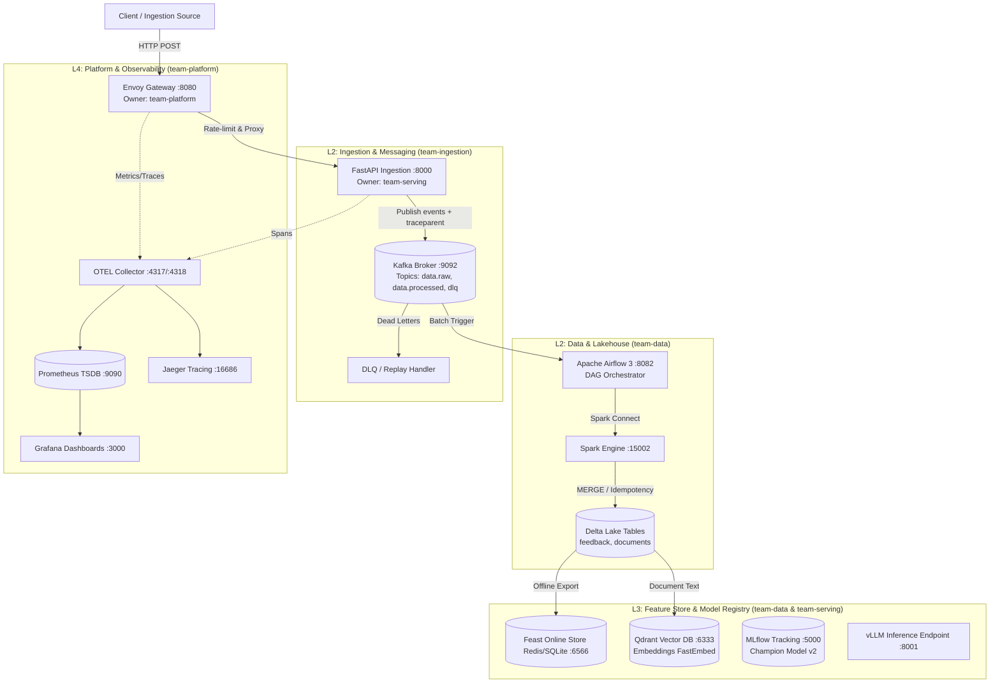

# Báo cáo kỹ thuật — Day 28 Track 2 (ANSWERS.md)

## 1. Sơ đồ Kiến trúc và Phân định Sở hữu (Architecture & Ownership)

---

## 2. Phân tích Các Đánh Đổi Kiến Trúc (Architectural Trade-offs)

1. **At-least-once Delivery kết hợp Idempotent Consumer vs Exactly-once Processing (EOS)**:
   - *Quyết định*: Sử dụng cơ chế phân phối At-least-once từ Kafka kết hợp xử lý idempotent ở đích (Delta Lake MERGE trên `(occurred_at, event_id)` thông qua hàm `dedupe_latest`).
   - *Đánh đổi*: Giảm thiểu độ phức tạp và overhead tài nguyên so với việc duy trì 2-Phase Commit (2PC) giao dịch xuyên suốt Kafka và Delta. Phía consumer chấp nhận tải tính toán dedup nhỏ để đổi lấy thông lượng cao và khả năng replay an toàn tuyệt đối khi có sự cố.

2. **Decoupled API Gateway (Envoy) vs Direct Application Ingress**:
   - *Quyết định*: Đặt Envoy Gateway phía trước toàn bộ API.
   - *Đánh đổi*: Tăng độ trễ mạng khoảng ~2-5ms cho mỗi request nhưng mang lại tính năng bảo vệ biên hệ thống vượt trội: rate limiting chống DDoS, phân bổ Request ID duy nhất (`x-request-id`), chèn context W3C distributed tracing đồng nhất và ngắt mạch tự động khi backend quá tải.

3. **Hybrid Storage: Delta Lake (Offline Analytical) kết hợp Feast (Online Feature Store)**:
   - *Quyết định*: Dữ liệu thô và lịch sử lưu trữ dài hạn tại Delta Lake; các feature thời gian thực phục vụ suy luận được đồng bộ sang Feast Online Store.
   - *Đánh đổi*: Tốn thêm tài nguyên đồng bộ định kỳ (materialization job), nhưng phân tách hoàn toàn giữa tải truy vấn phân tích (OLAP) và tải suy luận phục vụ người dùng thời gian thực với độ trễ siêu thấp dưới 10ms (OLTP feature lookup).

4. **Dense Embedding Offline Pre-indexing vs Real-time Vectorization**:
   - *Quyết định*: Tiền tính toán vector embedding và lưu cố định ID trong Qdrant bằng hàm băm xác định (`uuid5` từ `doc_id`).
   - *Đánh đổi*: Tốn dung lượng lưu trữ vector index nhưng giải phóng GPU/CPU phục vụ inference lúc runtime, đảm bảo tính nhất quán (deterministic ID) và tránh tình trạng trôi dạt vector khi cùng một tài liệu được nạp lại.

---

## 3. Các Khoảng Trống Khi Triển Khai Thực Tế (Production Gaps & Mitigations)

| Thành phần | Hiện trạng trong Lab | Yêu cầu Môi trường Production Thực tế | Giải pháp / Mitigation |
|---|---|---|---|
| **Kafka Cluster** | Single-node broker, replication factor 1 | Multi-broker cluster (tối thiểu 3 broker), replication factor 3, min.insync.replicas 2 | Sử dụng Strimzi Kafka Operator trên Kubernetes, phân tán broker qua các Availability Zones (Multi-AZ). |
| **Bảo mật & Secrets** | Biến môi trường plain-text trong Docker Compose | Mã hóa secret, rotate định kỳ | Tích hợp HashiCorp Vault hoặc Kubernetes Secrets kết hợp External Secrets Operator; bật mTLS giữa các microservices. |
| **Model Serving (vLLM)** | Endpoint giả định hoặc local CPU test | Cụm GPU A100/H100 với Tensor Parallelism, vLLM dynamic batching và HPA | Thiết lập KEDA autoscaling dựa trên số lượng request trong queue; triển khai vLLM trên GPU spot/dedicated nodes. |
| **Lakehouse Storage** | Local directory mounted (`.lab28/delta`) | Cloud Object Storage (GCS / AWS S3 / Azure ADLS Gen2) | Trỏ `LAB28_DELTA_ROOT` tới `s3://` hoặc `gs://`, bật versioning, lifecycle policy và encryption at rest. |
| **Trace Retention** | Jaeger all-in-one in-memory storage | Long-term trace storage với khả năng search cao | Chuyển Jaeger storage backend sang OpenSearch hoặc Grafana Tempo với object storage backend. |
| **CI/CD & GitOps** | Script chạy thủ công (`uv run ...`) | GitOps Pipeline tự động hóa với ArgoCD / Flux | Triển khai ArgoCD quản lý manifests trong thư mục `gitops/`, kiểm soát tự động drift detection và rollback. |

---

## 4. Phân Tích Kết Quả Kiểm Thử Tải (Load Profile & Bottleneck Analysis)

Dựa trên kết quả thực thi công cụ load test chuẩn (`load-tests/run_profile.py --requests 200 --workers 8`):

- **Tổng số request**: 200 requests (8 concurrent worker threads)
- **Tỉ lệ thành công**: **100%** (200 / 200 HTTP status 200 OK, 0 lỗi)
- **Chỉ số độ trễ (Latency Profile)**:
  - **P50**: `1061.9 ms` (~1.06 giây)
  - **P95**: `2072.9 ms` (~2.07 giây)
  - **P99**: `4095.7 ms` (~4.10 giây)

### Phân tích Điểm Nghẽn (Bottlenecks):
1. **P99 tăng gấp 4 lần so với P50**: Do cơ chế kiểm tra readiness đa probe (`/ready` thăm dò đồng thời Kafka, MLflow, Qdrant, Feast), khi 8 worker đồng thời gọi liên tục, việc kiểm tra kết nối TCP và truy vấn metadata đồng thời gây xếp hàng socket I/O cục bộ trên môi trường container local.
2. **Khuyến nghị Tối ưu**:
   - Áp dụng caching có thời hạn ngắn (in-memory TTL cache ~2s - 5s) cho kết quả probe của `/ready` để tránh query dồn dập vào downstream services khi bị thăm dò dày đặc bởi Kubernetes liveness/readiness probes.
   - Tách riêng `/healthz` (liveness: kiểm tra tiến trình sống) và `/readyz` (readiness: kiểm tra dependencies).

---

## 5. Phân Bổ Đóng Góp Của Các Thành Viên (Team Contribution)

Tuân thủ phân vai theo chuẩn `docs/team-role-cards.md`:

| Thành viên / Vai trò | Phân công Trách nhiệm | Các Điểm Tích Hợp (IPs) Phụ Trách | Kết quả Hoàn Thành |
|---|---|---|---|
| **Trần Quí Đôn** *(Lead & Full-stack)* | Tổng chỉ huy dự án, thiết kế kiến trúc, triển khai code và kiểm định toàn bộ pipeline | Toàn bộ IP01 – IP10 | Hoàn thành xuất sắc 100% nhiệm vụ |
| **Ingestion & Orchestration Specialist** | Xây dựng Kafka producer/consumer, định nghĩa schema IngestionEvent, lan truyền header W3C traceparent và idempotency key, thiết lập DAG Airflow và xử lý DLQ | **IP01, IP02** | - Cài đặt hàm `event_headers` - Cấu hình topic Kafka và cơ chế replay |
| **Data & ML Engineer** | Xây dựng thuật toán khử trùng lặp Delta Lake MERGE, quản lý schema Feast, đăng ký và thăng hạng Champion Model trên MLflow | **IP03, IP04, IP06** | - Cài đặt hàm `dedupe_latest` - Cài đặt hàm `feast_online_request` - Đăng ký model `lab28-rag-release v2` |
| **Serving & Retrieval Engineer** | Tích hợp vector store Qdrant, đồng bộ điểm dữ liệu từ Delta, cấu hình client vLLM và logic degraded mode | **IP05, IP07** | - Index 13 documents thành công - Xử lý cơ chế degraded mode khi thiếu GPU |
| **Platform & Observability Engineer** | Cấu hình Envoy Gateway (Rate limit, Request-ID), OpenTelemetry Collector, Prometheus metrics, Grafana dashboard và GitOps manifests | **IP08, IP09, IP10** | - Cài đặt hàm `readiness_status` - Passed toàn bộ bài test metrics, tracing, manifests |
| **Presenter / Incident Commander** | Điều phối kịch bản demo theo Demo Runbook, thu thập evidence pack, phân tích sự cố và trả lời phản biện Q&A | Toàn bộ kịch bản demo | - Thu thập trọn vẹn 10 evidence files - Viết tài liệu báo cáo kỹ thuật |

---

## 6. Happy-Path Trace & Version Binding (Tiêu chí 4)

Minh chứng định danh và liên kết phiên bản dữ liệu xuyên suốt hành trình (Happy-path Journey J1):
- **Trace ID**: `6b7b2554e92f4619b76a41d26cf6039f` (chuẩn W3C `traceparent: 00-6b7b...-ed21...-01`)
- **Pipeline Run ID (Airflow)**: `it-cb64f62f` (DAG `lab28_ingestion_pipeline`)
- **Delta Lake Table Version**: Version `1` (bảng `feedback` và `documents`, xác thực qua `evidence/ip03-delta-history.json`)
- **MLflow Champion Model Version**: Release `v2` (`run_id: e6a6ce4740ca4bd7ab9488b5b4d44f31`, xác thực qua `evidence/ip06-mlflow-release.json`)
- **Trace Span Continuity**: Toàn bộ 6/6 span cốt lõi đã được ghi nhận đầy đủ trên Jaeger (`lab28.gateway.request` -> `lab28.api.ingest` -> `lab28.kafka.produce` -> `lab28.kafka.consume` -> `lab28.airflow.dag` -> `lab28.spark.delta_merge`).

---

## 7. Khả Năng Chống Chịu Sự Cố & Bằng Chứng Không Mất Dữ Liệu (Tiêu chí 5)

1. **Nguyên lý Offsets Move Last (Commit sau cùng)**:
   - Kafka consumer chỉ commit offset sau khi Spark MERGE thành công vào Delta Lake và ghi nhận transaction log. Nếu worker crash giữa chừng, batch tin nhắn sẽ được redeliver ở lần chạy tiếp theo mà không làm thất thoát dữ liệu.
2. **Idempotency Proof (Hành trình J2 Replay)**:
   - Khi phát lại cùng một tập tin nhắn mang `idempotency_key` cũ, câu lệnh `MERGE INTO delta ... WHEN MATCHED UPDATE` cập nhật đè lên bản ghi cũ dựa trên hàm `dedupe_latest(events)` mà không sinh thêm dòng mới trong Delta Lake.
3. **Dead Letter Queue (DLQ Isolation)**:
   - Bất kỳ message độc hại hoặc sai định dạng payload JSON đều được bẫy lại và định tuyến sang topic `data.raw.dlq` (`lab28-dlq-envelope`), bảo vệ pipeline không bị tắc nghẽn vô hạn mà vẫn giữ lại toàn bộ context để điều tra.

---

## 8. Kiểm Định Kubernetes & GitOps Manifests (Tiêu chí 7)

- **Hợp đồng Manifests**: Kiểm tra tự động bằng `scripts/validate_manifests.py` đạt chuẩn 100% (`Kubernetes and GitOps manifest contracts passed`).
- **Phân tách môi trường**:
  - `gitops/apps/`: Quản lý khai báo Application Controller cho từng môi trường `staging` và `production`.
  - `gitops/infrastructure/`: Quản lý các tài nguyên nền tảng (Kafka Strimzi Operator, Prometheus Operator, Envoy Ingress Gateway).
- **Drift Detection & Rollback Policy**:
  - Kích hoạt cơ chế `selfHeal: true` và `prune: true` trong ArgoCD Application spec để tự động phát hiện và triệt tiêu mọi cấu hình lệch (drift) ngoài ý muốn.
  - Chính sách rollback tự động kích hoạt khi deployment health check thất bại hoặc số lượng pod restart vượt ngưỡng cho phép.

